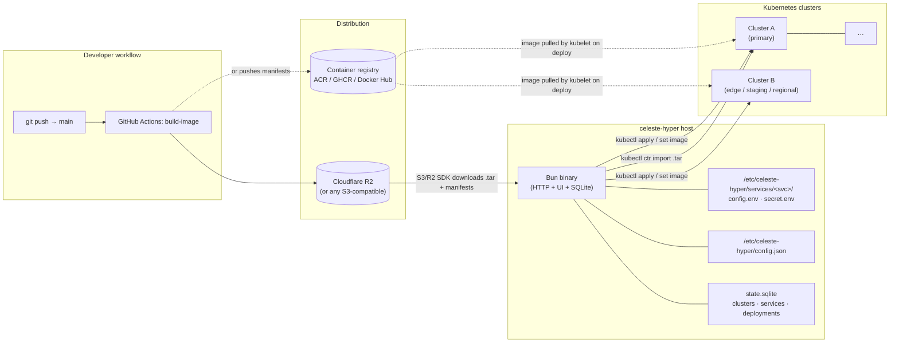
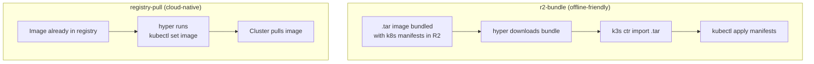
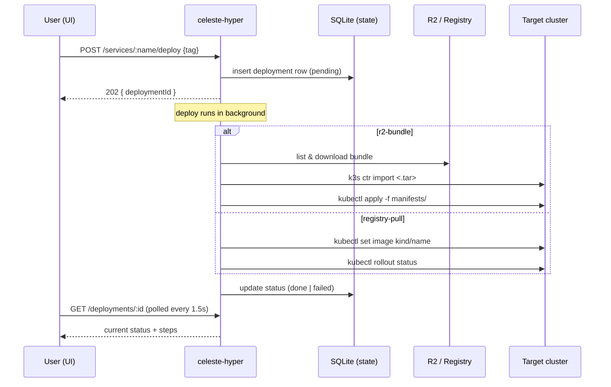
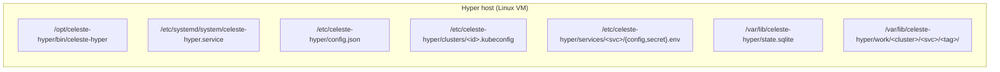
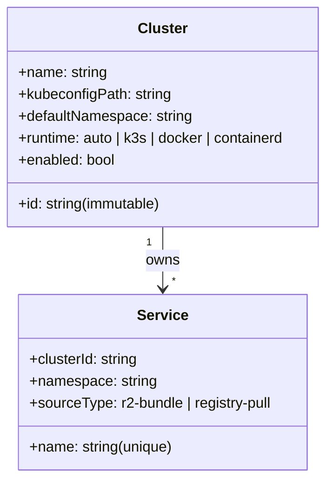

# Celeste Hyper — Documentation

Celeste Hyper is a self-hosted control plane for Kubernetes services whose images are distributed via Cloudflare R2 (or any S3-compatible object store) **or pulled from a container registry** (ACR, GHCR, Docker Hub, Harbor). It manages one or many clusters from a single binary, surfaces per-service environment files, streams live pod logs, and performs deploys in the background.

A single binary, written with [Bun](https://bun.sh), with a built-in HTTP API and an embedded Vite UI — no external runtime, no separate frontend bundle in production.

## Where to start

| If you want to… | Read |
|---|---|
| Get the big picture | [Architecture](./architecture.md) |
| Run two clusters locally and click around | [Local stack walkthrough](./local-stack.md) |
| Develop the Vite UI and package it into the binary | [Frontend workflow](./frontend.md) |
| Add a real production cluster | [Clusters & kubeconfig](./clusters.md) |
| Understand `r2-bundle` vs `registry-pull` | [Service sources](./sources.md) |
| Set up a CI pipeline that ships builds to R2 for hyper to deploy | [Cloudflare R2 for deployments](./cloudflare-r2-deployments/README.md) |
| Wire something against the HTTP API | [API reference](./api.md) |
| Operate the host (migrations, backups, auth) | [Operations runbook](./operations.md) |

## System design at a glance

## Two distribution models, one workflow

`r2-bundle` is ideal for k3s on-prem nodes that can't (or shouldn't) pull from a public registry. `registry-pull` is ideal when the cluster has registry credentials and the image is already published. The same control plane handles both side by side — see [Service sources](./sources.md) for full details.

## High-level flow when you click *Deploy*

## What lives where on disk

All paths are configurable; the defaults above match the systemd unit shipped in `deploy/`. Secrets never leave the host: `secret.env` files stay on disk (0600, root-only) and are projected into the cluster as Kubernetes `Secret` resources at deploy time.

## Multi-cluster posture

A single hyper instance can manage many clusters. The model is intentionally simple:

Each service belongs to exactly one cluster. A service named the same thing in two clusters is two separate registry entries (e.g. `payments-prod` and `payments-staging`). For details and the recommended kubeconfig handling for LAN vs WAN clusters, see [Clusters & kubeconfig](./clusters.md).

## Where the rest of the docs go

- **[Architecture](./architecture.md)** — internal modules, data flow, why each design choice
- **[Frontend workflow](./frontend.md)** — running backend and Vite separately in development, then embedding the UI into the production binary
- **[Clusters & kubeconfig](./clusters.md)** — adding clusters, kubeconfig hygiene, on-prem vs cloud, health checks
- **[Service sources](./sources.md)** — choosing between `r2-bundle` and `registry-pull`, bundle layout, image-tag listing
- **[Cloudflare R2 for deployments](./cloudflare-r2-deployments/README.md)** — the producer side: a platform-agnostic GitHub Actions template that builds, bundles, and ships to R2 for an `r2-bundle` deployer to pick up
- **[Local stack walkthrough](./local-stack.md)** — running the two-cluster demo via Docker Compose
- **[API reference](./api.md)** — every REST endpoint, request and response schemas
- **[Operations runbook](./operations.md)** — schema migrations, backups, first-run auth, the `bun run check` gate

If you only have time for one document, read **[Architecture](./architecture.md)** — it covers the moving parts and links out to the rest.
