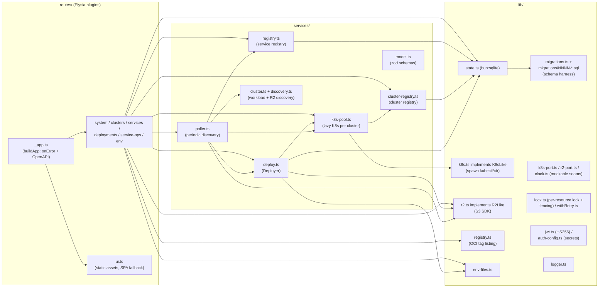
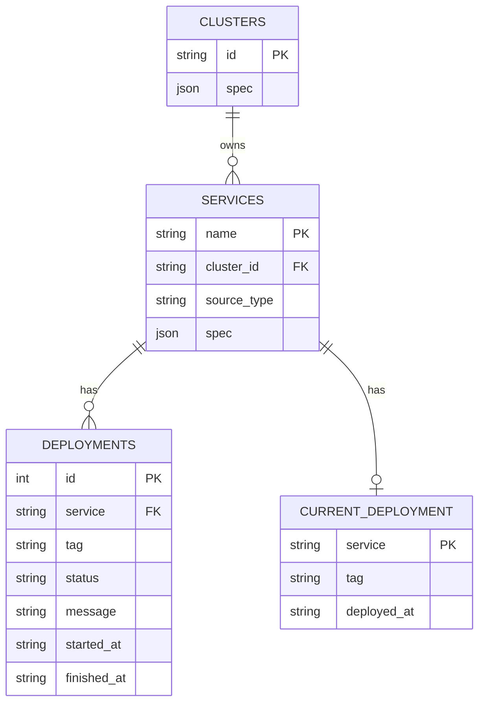
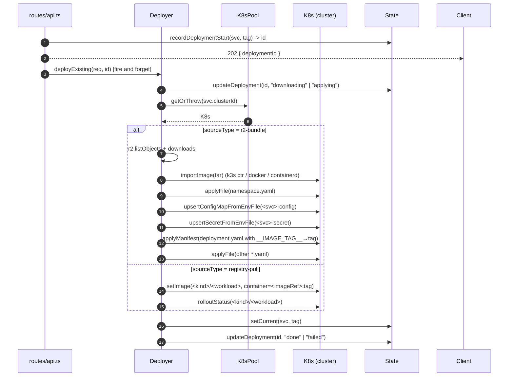
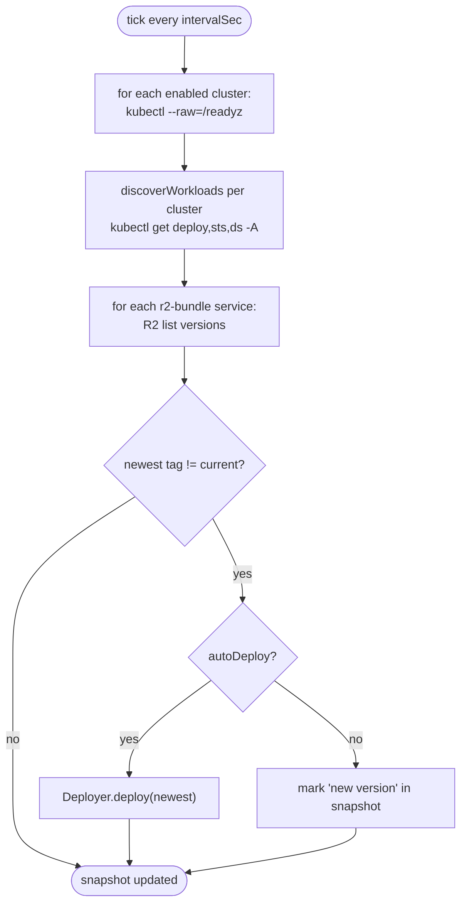
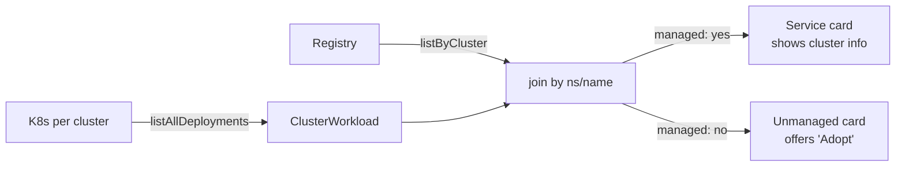
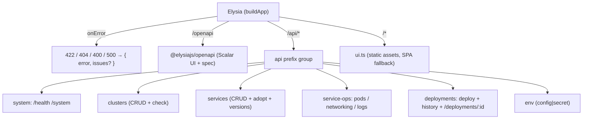

# Architecture

Celeste Hyper is a single Bun process that exposes an HTTP API plus an embedded UI. All non-trivial state lives in a local SQLite file; everything else is computed from the cluster(s) it talks to and from the R2 buckets it watches.

This document describes the internal modules, the data they own, and the in-process flows that connect them.

## Module map

The boundary the rest of the design rests on is **`K8sPool`**. It owns one `K8s` instance per cluster, lazy-built from the `kubeconfigPath` on disk. Everything that needs to talk to Kubernetes — the deployer, the poller, the HTTP handlers for pods/networking/logs — goes through the pool. Adding multi-cluster support meant rewriting nothing outside the pool's call sites.

## Data model

- **SQLite (`bun:sqlite`)** keeps the registry of clusters and services plus the deployment audit trail. Service spec and cluster spec are stored as JSON blobs inside a `spec` column — the column is keyed by the primary id and the schema validation lives in zod (`services/model.ts`).
- **Env files** are *not* in the database. They live on disk at `<envFilesDir>/<svc>/{config,secret}.env` with mode `0600` (secret) / `0644` (config). This is deliberate: secrets should be auditable as files and rotatable without touching the DB.
- **State** is intentionally cheap to rebuild — losing the SQLite file means losing audit history and the cluster/service registry, but no live cluster state.

### Schema migrations

The SQLite schema is owned by a migration harness (`lib/migrations.ts`), not by inline DDL.
Each change is a `lib/migrations/NNNN-description.sql` file, embedded into the binary as text
and registered in `lib/migrations/index.ts`. `State`'s constructor runs `applyMigrations`,
which applies pending files in lexical order inside `BEGIN IMMEDIATE` transactions, records
each in a `schema_versions` table (with a SHA-256 to detect drift), takes a pruned backup
before mutating an existing schema, and refuses to run an older binary against a newer DB
(downgrade protection). A failed or refused migration exits the process non-zero. See
[`operations.md`](./operations.md#schema-migrations) for the runbook.

An **offline state CLI** (`src/cli.ts` → `src/cli/state.ts`, P2.4) does `backup` (VACUUM INTO a
cold, WAL-free copy), `restore` (validate the source through the migration harness on a temp copy,
then swap), and `migrate` (apply pending migrations and exit). A PID-stamped `state.sqlite.lock` —
written at boot, removed on graceful shutdown — makes the CLI refuse to operate on a DB a live
process holds (a crash-stale lock from a dead pid is ignored, so a restart isn't bricked).

## Deploy pipeline

Notable invariants:

- **All deploys are background tasks**. The HTTP handler returns `202 Accepted` with a `deploymentId`; the UI then polls `GET /deployments/:id` every 1.5 s. This lets the dialog be closed mid-deploy without aborting anything.
- **Per-cluster work dir** lives at `<workDir>/<clusterId>/<svc>/<tag>/`. The same tag deployed to two clusters never collides.
- **`kubectl apply`** is idempotent: re-running a deploy with the same tag is safe and is how `auto-deploy` works.

## Poller

The poller never blocks the HTTP layer. Its output is a single in-memory `PollerSnapshot` containing: last tick timestamp, last error, the merged list of discovered workloads (each tagged with `clusterId`), the cluster health vector, and the map `service → new available tag`. The API surfaces this snapshot through `GET /api/system` and `GET /api/services`.

If `poller.autoDeploy` is true, a new tag observed in R2 triggers a real deploy through the same Deployer the UI uses.

## Discovery

Two discovery axes:

- **R2 versions** for `r2-bundle` services: `r2.listPrefixes('<svc>/')` → check each prefix has the expected `.tar` → sort tags lexically descending (numeric-aware, so CalVer and SemVer both work).
- **Cluster workloads** for the entire cluster set: `kubectl get deployments,statefulsets,daemonsets -A -o json` per cluster. Each entry is tagged with the originating `clusterId` and joined with the registry to decide if it's *managed* or *unmanaged*.

## HTTP layer

A single `Elysia` app, assembled by `buildApp(deps)` in `routes/_app.ts`. Each resource is a
small Elysia plugin (`system`, `clusters`, `services`, `deployments`, `service-ops`, `env`),
mounted under an `/api` prefix group; the static-asset plugin (`ui.ts`) serves the embedded
Vite build with SPA fallback; `@elysiajs/openapi` exposes the spec at `/openapi/json` and a
Scalar UI at `/openapi`.

- **Dependency injection** is by closure: each plugin is a factory `(deps) => new Elysia(...)`
  that captures the shared `ApiDeps`. No globals, no `.decorate` (keeps strict-mode typing clean).
- **Authentication** (P0.4): the `/api` group runs an `onBeforeHandle` guard that 401s any
  non-carve-out route lacking a valid `hyper_session` cookie or `Authorization: Bearer` JWT
  (`routes/auth.ts` `authenticate`); carve-outs are health/login/version plus self-authenticating
  surfaces such as `/api/enroll`. Sessions are HS256
  JWTs (`lib/jwt.ts`, alg-pinned); passwords are argon2id (`lib/password.ts`); secrets resolve
  via `lib/auth-config.ts`; users/secret live in SQLite (`users`/`meta`). On first boot a
  temporary `admin`/`admin` is auto-created with `must_change_password`; the UI forces a change
  via `POST /api/change-password`. Login is rate-limited per-IP and per-username.
- **Authorization & CSRF** (P0.5): the same guard enforces roles (`admin`>`operator`>`viewer`)
  via `routes/role-map.ts` (reads→viewer, mutations→operator) and, for cookie-auth mutations,
  a CSRF check — login mints a per-session `csrf` JWT claim, `/api/me` returns it, and the
  client echoes it as `X-CSRF-Token`. Bearer (CLI) clients are CSRF-exempt.
  `X-Forwarded-*` headers are treated as trustworthy only when `HYPER_TRUST_X_FORWARDED=1` is set behind
  an operator-controlled proxy/Tunnel that overwrites them; otherwise direct requests do not get to
  choose their rate-limit identity or join URL.
- **Machine tokens & webhooks** (P1.10, `routes/integrations.ts`). Two non-human entry points share
  the same guard. **Machine tokens** are bearer credentials with the `cht_` prefix: `authenticate`
  recognizes the prefix, looks up an HMAC-SHA256 (keyed by the server secret) of the presented token
  in `machine_tokens`, and falls back to JWT on a miss — so the cleartext is shown once and never
  stored. A token's `role` (operator|viewer, never admin) feeds the existing role check; an optional
  `serviceScope`/`clusterScope` is enforced by `routes/scope.ts` `withinScope` (added to the guard
  after the role check): a scoped token is confined to its service's endpoints (resolving
  `/api/deployments/:id` & `/api/jobs/:id` back to their owning service so CI can still poll), and a
  cluster scope requires the service to live there. **Webhooks**: the receiver
  `/api/webhooks/registry/:secretId` is an auth carve-out — the unguessable `:secretId` plus an
  `X-Hub-Signature-256` HMAC over the raw body (verified *before* JSON-parsing) authorize it. The
  per-registry payload parser (`lib/registry-webhooks.ts`, dockerhub|ghcr|acr|generic) normalizes
  to `(imageRef, tag)`; hyper matches managed registry-pull services by normalized image ref and
  enqueues deploys through the same queue + degraded/dedup guards as the HTTP deploy. Management CRUD
  (`/api/machine-tokens`, `/api/webhooks`) is admin-only via `role-map.ts`.
- **Network discovery** (P1.11, `services/network-scan.ts` + `routes/discovery.ts`). `POST
  /api/discovery/scan` (admin-only, consent-gated) expands IPv4 targets/CIDRs (capped at 1024 IPs),
  then probes each `(ip, port)` with bounded concurrency (semaphore of 64) for a Kubernetes
  apiserver — a TLS handshake (cert verification skipped) + anonymous `GET /version`, matched against
  the documented `major`/`minor`/`gitVersion` shape and fingerprinted into a distribution. The pure
  logic (CIDR expansion, version fingerprint, probe classification) is split from the I/O
  (`VersionProbe`, injected via `deps.netProbe`) so the whole scan is unit-tested without a socket;
  the real probe uses Bun `fetch` with `tls.rejectUnauthorized:false` + an `AbortSignal.timeout`.
  Promotion to a cluster is a frontend convenience (prefills the Add Cluster form); hyper never
  fabricates a kubeconfig. Each scan is logged with the operator + targets (persistent audit → P2.1).
- **Fleet enrollment** (P4.1, `services/enrollment.ts` + `routes/enrollment.ts` + `lib/enrollment-token.ts`).
  A master turns a fresh LAN machine into a managed cluster without the manual kubeconfig dance. Admin-only
  CRUD (`/api/enrollment-tokens`) mints a one-shot, HMAC-stored (`che_` prefix, distinct key domain from
  machine tokens), short-TTL token that pre-declares the cluster id/runtime/`imageLoad` the worker will
  become. `deploy/join.sh` installs single-node k3s on the worker and `POST`s its kubeconfig to the
  `/api/enroll` **carve-out** (the token *is* the credential — a worker has no session). `EnrollmentService`
  redeems the token atomically (single-use), **sanitizes the kubeconfig by parsing the YAML and walking the
  object graph** (rejecting `exec`/`auth-provider`/`proxy-url`/`insecure-skip-tls-verify`/external-file
  refs — a regex denylist is unsafe against flow-style YAML), validates the effective `current-context`
  resolves to declared context/cluster/user entries with https + embedded CA + embedded static creds,
  writes it `0600` via an exclusive temp-file +
  atomic rename under `cfg.clustersDir`, registers the cluster (`origin: "enrolled"`), primes the pool +
  capability probe, and audits explicitly (the HTTP audit hook skips carve-outs). Generated join commands
  validate the external master URL and shell-quote every environment value. Migration `0016`;
  `origin`/`enrolledAt` are server-owned (stripped from the client create/update schemas).
- **Remote bundle delivery** (P4.3, `services/bundle-import.ts` + `services/deploy.ts`). A per-cluster
  `Cluster.imageLoad` (`local` default | `remote-pull`) decides how an r2-bundle image tar reaches the
  node. `local` = today's `ctr import` on the hyper host (correct only when hyper *is* the node).
  `remote-pull` (enrolled clusters' default) skips the local import: the deployer presigns the tar
  (`R2Like.presignGet`) and runs a one-shot **privileged in-cluster import Job** (`buildBundleImportJob` —
  a tiny curl container that fetches the tar then runs the **node's own k3s binary** — hostPath-mounted,
  exact-version match, no 250 MB image pull — as `k3s ctr -n k8s.io images import` against the host
  containerd socket; the presigned URL via env not argv, `backoffLimit:0` + `activeDeadlineSeconds` +
  `ttlSecondsAfterFinished`), polls it to completion (past the Job deadline), captures its logs on failure,
  and tears it down (deleting any prior Job first so retries are clean). So a bundle deployed from the
  master lands the image on the *worker's* node — no registry credentials on the cluster. `registry-pull`
  (ACR/GHCR/…) is unaffected — the node always pulls those itself. The builder + `runRemoteBundleImport`
  orchestration are pure/port-mockable and were live-validated end to end (`scripts/fleet-r2-sim.sh`).
- **git-sync source type** (P2.3, `lib/git.ts` + `services/deploy.ts` `deployGitSync` + `services/poller.ts`).
  A third `sourceType`: manifests come from a git repo at a ref. The pure validators (`validateGitUrl`
  SSRF allowlist + transport check, `gitHost`, `validateGitPath`/`validateDeployKeyPath` traversal,
  `parseLsRemote`) are split from a thin injected `GitLike` runner (the real one spawns `git`, passes
  the deploy key via `GIT_SSH_COMMAND` — never argv — and bounds itself with a timeout + stdout cap).
  Create/update validate the git fields (empty allowlist ⇒ git-sync disabled); the deployer
  re-validates (defense in depth), shallow-clones `--branch <ref>` (url/dest after `--`; `gitRef`
  constrained to git's ref grammar so it can't inject a flag), resolves the HEAD sha, and applies
  `gitPath` via the r2-bundle apply pipeline. The poller `ls-remote`s each git-sync ref (sequential,
  bounded by the runner's 10 s timeout) to surface new SHAs.
- **Helm release ops** (P2.2, `lib/helm.ts` + `routes/helm.ts` + `queue/handlers/helm-upgrade.ts`).
  Gated on the `helmCli` host capability. Helm-managed detection reads the workload's standard
  `meta.helm.sh/release-name`/`-namespace` annotations (not `ownerReferences`). The pure layer
  (`parseHelmList`, `helmReleaseFromAnnotations`, `redactValues`, the argv builders) is split from a
  thin injected `HelmLike` runner (the real one spawns `helm` with the cluster's KUBECONFIG, argv
  form). `GET …/helm` returns the release/chart/version + `helm get values` with sensitive keys
  masked server-side. `POST …/helm/upgrade` enqueues a `helm-upgrade` job (per-service lock + fencing,
  like deploy/rollback) that runs `helm upgrade … --set <operator-configured value path>=<tag>
  --wait`, then **verifies** the tag reached the pod template (a wrong `helmImageTagValuePath` fails
  the job with `helm-upgrade-did-not-take-effect` instead of silently no-op'ing). We never guess the
  values key — all three Helm fields are operator-supplied.
- **Audit trail** (P2.1, `lib/audit.ts` + `routes/audit.ts`). Every mutation appends to
  `audit_events`. `recordAudit` writes via `state.database`, so a call made inside
  `state.transaction(...)` commits/rolls back atomically with the action it records — a rolled-back
  mutation leaves no row (unit-tested). HTTP coverage is centralized: the `/api` group `derive`s the
  principal once per request (per-request context, not the global store — no cross-request race),
  the guard reuses it, and an `onAfterResponse` hook records every non-GET with the **final** status
  as the outcome — so guard denials (401/403) and validation failures (422) are audited as `fail`,
  not dropped. Request bodies are never logged (only method, path-derived resource, actor, result) so
  body secrets never reach the trail. The worker audits each terminal job outcome (not retries)
  attributed to `system` via an injected sink. Reads are keyset-paginated over `(ts, id)` (stable
  under concurrent inserts). Daily pruning of old rows is a documented follow-up.
- **Validation** stays in the zod schemas (`services/model.ts`) inside handlers, so defaults,
  the id regex, and the `sourceType` discriminated union are the single source of truth.
  Schema-invalid request bodies return **422** (Elysia/TypeBox convention); business-rule
  failures keep their codes (409 duplicate, 404 not-found, 400 unknown-cluster / immutable-id /
  sourceType-change). The frontend already treats 400 and 422 identically.
- **SSE.** `/api/services/:name/logs` is the only streaming endpoint. The handler returns an
  async generator that merges the spawned `kubectl logs -f` stdout/stderr line-by-line into
  `event: stdout` / `event: stderr` frames via `sse(...)`, emits `event: end` with the exit
  code, sends an `event: heartbeat` frame every 15 s (defeats idle-buffering proxies; the
  browser listens only for stdout/stderr/end, so it's ignored client-side), and kills the
  subprocess in a `finally` block when the client disconnects (the request `AbortSignal` both
  kills the process and wakes the parked generator so cleanup always runs).
- **Log-stream auth.** `EventSource` can't attach an `Authorization` header, so the stream is
  carved out of the global guard and self-authenticates: a one-shot `?logToken=` (minted via
  `POST /api/services/:name/logs/token`, a viewer-level read, scoped to that service, 60 s TTL,
  single-use) **or** a normal cookie/bearer session for `curl`/scripts. Tokens live in the
  `log_tokens` table; `redeemLogToken` flips `used_at` in one atomic `UPDATE … WHERE used_at IS
  NULL AND expires_at > now`, so concurrent or replayed redemptions lose the race and get 401.
- **Job queue (`src/queue/`).** Every deploy is a persistent row in the `jobs` table, not a
  fire-and-forget promise, so it survives a restart. `Queue` (data-access sibling of `State`/
  `lock.ts`) owns the table SQL; a single-threaded `Worker` loop reaps expired leases, atomically
  claims the oldest due job (`UPDATE … WHERE id=(SELECT … WHERE state='pending' AND
  next_attempt_at<=now ORDER BY id LIMIT 1) RETURNING *`), takes the per-service `Lock` (recording
  its monotonic **fencing token** on the job), runs the kind's handler under a 10 s lease heartbeat
  (lease 30 s), and marks the job `done`/`failed`. Retries use exponential backoff
  (`min(60s, 5s·2^attempts)`); a handler that exhausts its attempts is `failed`, a job whose worker
  died (lease expiry) is requeued or, when exhausted, `dead`. The final `current_deployment` write
  goes through `fencedSetCurrent` gated on the fencing token, so a zombie worker can't overwrite a
  newer deploy. **Invariant:** a deploy job's `id` equals its `deployments.id` (the enqueuer creates
  the deployment row first), so the legacy `GET /api/deployments/:id` is populated immediately while
  `GET /api/jobs/:id` exposes the richer attempts/lease/last_error view. `SIGTERM`/`SIGINT` stops
  claiming and waits up to 30 s for the running job before closing the DB. A second job kind,
  `rollback` (P1.1, registry-pull only), runs `kubectl rollout undo` under the same lock/fencing;
  the previous tag is resolved from hyper's own history first, the cluster's `rollout history`
  second, and `current_deployment` is set to the expected tag only if the resulting pod image
  confirms it (else the actual image / `rollback-rev-N` + a warning).
- **Deploy modes (`src/services/deploy.ts` + `deploy-manifest.ts`, P1.7).** A registry-pull service
  picks a `deployMode`: `rolling` (default — `set image` + `rollout status`), `recreate` (patch
  `spec.strategy.type=Recreate` first), `canary` (clone the workload into a `<workload>-canary`
  sibling on the new image, soak-observe its readiness for `successThreshold` ticks over
  `observationSec`, promote to the main workload then tear the canary down — `finally`-guaranteed),
  or `blue-green` (create a `<workload>-green` deployment with a fresh label set so the Service
  doesn't route to it pre-cutover, wait ready, JSON-patch-*replace* the Service selector to green,
  drain blue to zero). `canary`/`blue-green` require a Deployment (the `PATCH /services` route
  returns 422 otherwise). Manifest clones strip server-managed fields and are pure-function tested.
  **Known limitation:** blue-green is single-flip (repeated deploys update green in place, not
  alternating colours), and the live promote/abort/flip/hold controls are deferred (the gates run
  automatically).
- **Health gate (`src/services/health-gate.ts`, P1.8).** Opt-in per service (`healthGate`). After
  `kubectl rollout status` returns, the deploy polls steady-state health before promoting
  `current_deployment`: it passes only when `readyReplicas == replicas` for `successThreshold`
  consecutive samples, and fails fast on `CrashLoopBackOff`/`ImagePullBackOff`/`ErrImagePull`/
  `OOMKilled` or a restartCount jump ≥ 2, and on `observedGeneration != generation` at timeout. The
  result `{ attempts, ok, lastReason }` is stored in `deployments.health_gate_result` and shown in
  the history. Blue-green runs the gate on the green deployment *before* flipping the Service. A
  failed gate fails the deploy (the signal P1.9 auto-rollback consumes).
- **Web terminal / `kubectl exec`** (P3.2, `services/exec.ts` + `routes/service-ops.ts` `.ws` +
  `lib/k8s.ts` `streamExec`). An interactive pod shell over a WebSocket. **RCE-equivalent**, so:
  the mint (`POST …/exec/token`, operator+) verifies the pod/container backs *this* service (same
  `findPodSelector` guard as logs) and issues a **single-use, 60 s, (service,pod,container)-bound**
  token; the WS (`WS …/exec?token=`) is an auth carve-out that redeems the token (a browser WS can't
  send an `Authorization` header) and execs the token's *bound* target — the URL can't widen it. The
  pump (`ExecSession`) is isolated from the Elysia handler so it's unit-tested with fakes: child
  stdout/stderr → socket, socket → child stdin; teardown is idempotent and kills the child on close.
  DoS bounds: a global concurrent-session cap (16) and a 30-minute hard lifetime (idle shells can't
  linger, since the exec has no client timeout). Migration `0014-exec-tokens`.
- **Custom-resource browser** (P3.1, `services/crds.ts` + `routes/clusters.ts`). Operator-gated
  read-only endpoints over a cluster's CRDs: list CRDs, list a kind's objects, view one as YAML. Pure
  parsers (`parseCrdList`/`parseCrList`, prefer the storage version, validate `<plural>.<group>`) are
  split from the kubectl calls (argv + `--` separator). The object/YAML endpoints first verify
  `:resource` names a *registered CRD* (`kubectl get crd -- <resource>`) so they can't be pointed at
  `secrets.`/`configmaps.` to read core-resource data through the CRD surface. Read-only — no CR edits.
- **Admission preflight** (P3.3, `services/preflight.ts`). `GET …/preflight?tag=` runs
  `kubectl set image … --dry-run=server` for a registry-pull bump (argv form; tag + workload/container
  names validated before interpolation), so admission webhooks/policies reject *into the deploy modal*
  rather than into a failed job. Advisory only (a transient webhook outage must not wedge deploys);
  `applicable:false` for the manifest-bundle source types (they'd need the materialized manifests).
- **Auto-rollback (`src/queue/handlers/deploy.ts` + `rollback.ts`, P1.9).** Opt-in per registry-pull
  service (`autoRollback`). When a deploy fails its health gate, the deploy handler resolves the
  rollback target (same Source A/B logic as manual rollback), enqueues a `rollback` job (`auto:true`)
  delayed by a 10 s grace window, and makes the deploy attempt **terminal** (`queue.noRetry`) — a
  retry would re-apply the bad image and race the rollback for the fencing token. The enqueue is
  deduped (`hasActiveJob`) so one bad deploy yields at most one rollback. The rollback, claimed after
  the deploy, gets a higher monotonic fencing token and so wins the `current_deployment` write; its
  finalize (fenced set + terminal status + clear-degraded) is one transaction. **Single-shot:** if
  the auto-rollback itself fails it marks the service `degraded` (`service_degraded` table, migration
  `0010`); a degraded service is refused at the deploy route (409), the worker chokepoint, and the
  poller until an operator clears it (`POST /undegrade`). The 10 s grace is a queue `delayMs`; the UI
  shows a countdown + cancel (`POST /auto-rollback/cancel`, removes the still-pending job). A
  successful rollback (auto or manual) clears `degraded`.
- **Capability discovery (`src/services/capability-probe.ts`).** The UI gates features (HPA, Helm,
  metrics) on what a cluster/host actually supports, never a hardcoded assumption. Each capability
  is a record `{ value, source: "cluster"|"host", lastCheckedAt, error? }`. **Cluster-level**
  capabilities (`ingressV1`, `networkingV1`, `hpaV2`, `metricsServerV1Beta1`,
  `statefulSetRollout`, `daemonSetRollout`) come from `kubectl api-versions` — presence of a
  `group/version` (e.g. `autoscaling/v2` → `hpaV2`). (The plan named `api-resources -o json`, but
  its JSON shape isn't stable across kubectl builds; `api-versions` is documented and covers every
  gated capability.) **Host-level** capabilities (`helmCli`, `k3sCli`, `ctrCli`) come from `which`
  and apply to every cluster this binary serves; they live in `meta`, cluster ones in
  `cluster_capabilities`. The probe runs at registration (`POST /clusters`), on `PATCH`, on
  `POST /clusters/:id/check`, and on a 24 h cadence in the poller; `GET /clusters` merges both
  sources into one `capabilities` map per cluster. The probe never throws — an unreachable cluster
  yields all-false records carrying the error.

## Why these choices

| Choice | Rationale |
|---|---|
| **Bun, single binary** | Zero runtime to install; the same artifact ships to laptops, VMs, and CI. |
| **`kubectl` via `spawn`** | Reuses the operator's existing auth surface and avoids embedding a Go client. The output we need is small and structured. |
| **No real Kubernetes client library** | Watch streams aren't required — the poller is good enough for the cadence (default 60 s, 15 s in the demo). |
| **SQLite, not Postgres** | State is small and the writes are serialized to a single process. WAL mode keeps reads concurrent. |
| **Embedded Vite UI** | Keeps React development isolated under `frontend/` while preserving the single-binary production artifact. |
| **No registry as a dependency** | `r2-bundle` flow can run fully offline with `imagePullPolicy: Never`. The cluster never needs registry credentials. |

## What's not here

- **Watch APIs** — the poller does periodic `get`s. For large clusters this should switch to informers / shared caches, but it's not the bottleneck today.
- **Per-cluster pollers** — there's one tick loop that iterates clusters serially. Per-cluster intervals would be a small refactor in `poller.ts`.
- **Registry credentials management** — `registry-pull` assumes any required `imagePullSecret` already exists in the target namespace.
