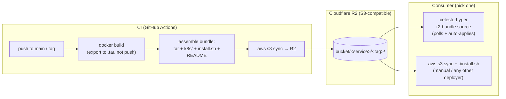
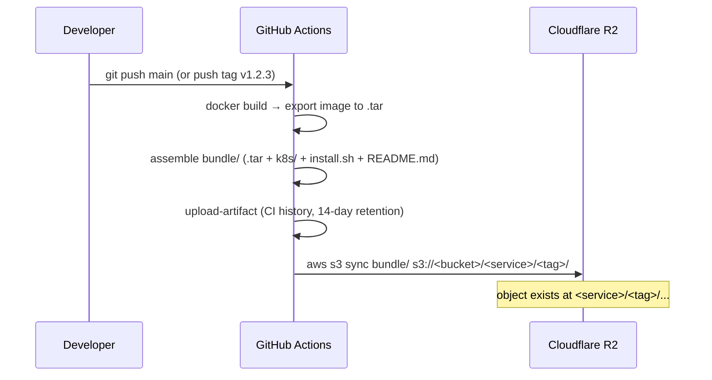

# Cloudflare R2 for deployments

A platform-agnostic recipe for shipping a build (a container image plus its Kubernetes manifests)
from CI to a cluster through [Cloudflare R2](https://developers.cloudflare.com/r2/) instead of a
container registry. R2 speaks the S3 API, so the entire pipeline is just `aws s3` commands against
a different endpoint — no Cloudflare-specific SDK or tooling required on either end.

This is the producer side of the contract celeste-hyper's `r2-bundle` source type consumes — see
[Service sources](../sources.md) for what happens after a bundle lands in the bucket. You don't
need celeste-hyper to use this guide; any deployer that can run `aws s3 sync` against an R2 bucket
works the same way.

## Why R2 instead of a registry

| | Registry pull | R2 bundle |
|---|---|---|
| Cluster needs | Network egress to the registry, `imagePullSecret` | Network egress to R2 (or none, if pulled from a jump host) |
| Works air-gapped / behind a restrictive firewall | No | Yes |
| Image + manifests versioned together | No (two separate artifacts) | Yes (one bundle, one prefix) |
| Cost | Registry storage/bandwidth pricing | R2 has **zero egress fees**; you pay storage only |
| Transfer | Layer-by-layer, cached | Whole `.tar`, no layer cache |

Use R2 when the cluster can't (or shouldn't) reach a registry, or when you want the image and its
manifests to travel and be retained as one versioned unit. Use a registry when the cluster already
has pull access and you want native incremental layer pulls. The two are not mutually exclusive —
see [Service sources](../sources.md#choosing-per-environment) for picking per service.

## How it fits together



## Prerequisites

- A Cloudflare account with R2 enabled (R2 has its own opt-in/billing in the dashboard).
- A repo that builds a container image and has (or can have) a `deploy/` folder with Kubernetes
  manifests — see [`templates/deploy/`](./templates/deploy/) for a ready-made starting point.
- `aws-cli` to test locally. It's preinstalled on GitHub-hosted `ubuntu-latest` runners, so CI
  needs no extra setup step.

## 1. Create the bucket

Dashboard: **R2 Object Storage → Create bucket**. CLI, via [Wrangler](https://developers.cloudflare.com/workers/wrangler/):

```bash
wrangler r2 bucket create <bucket-name> --location=<wnam|enam|weur|eeur|apac|oc>
```

`--location` is a hint, not a hard region pin — R2 buckets are globally accessible either way. One
bucket is enough for many services: the convention below namespaces objects by `<service>/<tag>/`,
so a single bucket can hold every service's build history.

Keep the bucket **private** (the default). There's no reason to expose deploy artifacts publicly,
and a public bucket changes the security model entirely (see [Security](#security)).

## 2. Create scoped API tokens

R2 API tokens are S3-compatible Access Key ID / Secret Access Key pairs, scoped per-bucket and
per-permission via **R2 Object Storage → Manage API tokens → Create API token**.

Create **two** tokens — least privilege, and a leaked CI token can't be used to read your fleet's
deploy history, nor can a leaked deployer token publish a malicious build:

| Token | Permission | Scope | Used by |
|---|---|---|---|
| CI writer | `Object Read & Write` | This bucket only | The GitHub Actions workflow (uploads bundles) |
| Deployer reader | `Object Read` | This bucket only | celeste-hyper or any other consumer (only ever lists/downloads, never writes) |

Each token gives you an **Access Key ID**, a **Secret Access Key**, and the account's **S3
endpoint**:

```
https://<ACCOUNT_ID>.r2.cloudflarestorage.com
```

`<ACCOUNT_ID>` is your Cloudflare account ID (Dashboard → right sidebar on any domain, or `wrangler
whoami`). The endpoint is the same for every bucket in the account — only the bucket name in the
path/host changes per request.

## 3. Bundle layout convention

This is the one thing every producer and every consumer must agree on. It's the same shape
celeste-hyper's `r2-bundle` deployer expects (see [Service sources](../sources.md#r2-bundle-in-detail)):

```
s3://<bucket>/<service-name>/<tag>/
  <service-name>-<tag>-amd64.tar     # docker image, ready for `ctr import` / `docker load`
  k8s/
    namespace.yaml
    deployment.yaml                  # template, keyed by __IMAGE_TAG__
    deployment.rendered.yaml         # same file with the tag already substituted
    service.yaml
    ...                              # any other plain *.yaml (ingress, configmap, etc.)
  install.sh                         # manual/offline path; ignored by automated deployers
  README.md
```

`<tag>` is whatever you tag builds with — git short SHA on every push to `main`, or the pushed git
tag (`v1.2.3`) for releases. Each tag gets its own prefix, so old builds stay available until you
prune them (see [Lifecycle](#lifecycle-pruning-old-builds)).

## 4. Configure repository secrets and variables

In the producing repo: **Settings → Secrets and variables → Actions**.

| Name | Kind | Value |
|---|---|---|
| `R2_ACCESS_KEY_ID` | Secret | CI writer token's Access Key ID |
| `R2_SECRET_ACCESS_KEY` | Secret | CI writer token's Secret Access Key |
| `R2_BUCKET` | Variable (or Secret) | The bucket name |
| `R2_ENDPOINT_URL` | Variable (or Secret) | `https://<ACCOUNT_ID>.r2.cloudflarestorage.com` |

Bucket name and endpoint aren't sensitive, so Variables are the natural fit — keeps them visible in
the Actions UI for debugging. The template workflow accepts either (`vars.X || secrets.X`).

## 5. Drop in the workflow and the deploy folder

Copy [`templates/github-actions/build-and-upload-to-r2.yml`](./templates/github-actions/build-and-upload-to-r2.yml)
into the target repo's `.github/workflows/`, and [`templates/deploy/`](./templates/deploy/) into
the target repo's root as `deploy/`. Then, one-time:

1. In the workflow, set `env.IMAGE_NAME` to your service name.
2. In `deploy/install.sh`, set `SVC_NAME` to the same service name.
3. In every file under `deploy/k8s/`, replace the placeholders:
   - `__SERVICE_NAME__` → your service name (must match `IMAGE_NAME` / `SVC_NAME` above — it's how
     `install.sh` recovers the tag from the tar filename unambiguously even when the tag itself
     contains a hyphen, e.g. `v1.2.3-rc1`)
   - `__NAMESPACE__` → the target namespace (often an environment name like `prod` or `staging`,
     not necessarily the same as the service name — one namespace commonly holds many services)
   - Leave `__IMAGE_TAG__` alone — the workflow substitutes it per-build, that one isn't a one-time edit.
4. Make sure the repo has a `Dockerfile` the workflow can build (the template assumes one at the
   repo root; adjust the `file:` path in the workflow if yours lives elsewhere).
5. Adjust `containerPort` / health-check paths / resource requests in `deployment.yaml` to match
   your app.

The R2 upload step is skipped (not failed) when `R2_ACCESS_KEY_ID` is unset, so it's safe to land
the workflow before secrets are configured — it'll just build and stop at the artifact upload.

## 6. What happens on push



## 7. Pulling a bundle manually

Useful for a first try, a one-off box, or any deployer that isn't celeste-hyper:

```bash
aws s3 sync s3://<bucket>/<service-name>/<tag>/ ./<service-name>-<tag>/ \
  --endpoint-url https://<ACCOUNT_ID>.r2.cloudflarestorage.com

cd <service-name>-<tag>
./install.sh
```

`install.sh` auto-detects the container runtime (`k3s` if present, else `docker`) and applies the
manifests in `k8s/`. See [`templates/deploy/install.sh`](./templates/deploy/install.sh) for the
full set of overridable env vars (`RUNTIME`, `KUBECTL_CONTEXT`, `NAMESPACE`).

## 8. Wiring celeste-hyper to the bucket

If celeste-hyper is the consumer, point it at the same bucket using the **deployer reader** token
from step 2 — either in `config.json`:

```json
{
  "r2": {
    "endpoint": "https://<ACCOUNT_ID>.r2.cloudflarestorage.com",
    "bucket": "<bucket-name>",
    "accessKeyId": "<deployer-reader-access-key-id>",
    "secretAccessKey": "<deployer-reader-secret-access-key>",
    "region": "auto"
  }
}
```

or the equivalent environment variables (`R2_ENDPOINT_URL`, `R2_BUCKET`, `R2_ACCESS_KEY_ID`,
`R2_SECRET_ACCESS_KEY`), or through the Settings UI at runtime. Hyper supports more than one named
R2 source if different services live in different buckets/accounts — register a service with
`sourceType: r2-bundle` and `r2Prefix: <service-name>/` and the poller takes it from there. Full
detail on the apply pipeline, configuration fields, and tag listing: [Service sources](../sources.md#r2-bundle-in-detail).

The CI writer token from step 2 should **never** be given to celeste-hyper — it only needs to read.

## Security

- **Two tokens, least privilege**: CI gets write, the deployer gets read-only, both scoped to one
  bucket. Neither token should be `Admin Read & Write` (that scope also manages CORS/lifecycle/
  other buckets in the account).
- **Keep the bucket private.** There's no reason for deploy bundles to be public; a public bucket
  would let anyone download your images and manifests.
- **Secrets never travel through the bundle.** `*.example.yaml` files (if you add a configmap or
  secret template) are illustrative only — real config and secrets are applied by the deployer from
  its own filesystem or secret store at deploy time, never committed or bundled. This matches how
  celeste-hyper applies `config.env` / `secret.env` per service — see [Service sources](../sources.md).
- **Rotate tokens** the same way you'd rotate any cloud credential — Cloudflare lets you revoke a
  token without touching the bucket itself, so rotation doesn't require a migration.

## Lifecycle: pruning old builds

Every push creates a new `<service>/<tag>/` prefix; nothing deletes the old ones automatically.
R2 has no egress fees, but storage still costs, and an unbounded bucket gets noisy to browse. Set a
lifecycle rule to expire old prefixes after N days once you've decided how far back you need
rollback history:

```bash
cat > lifecycle.json <<'EOF'
{
  "Rules": [
    {
      "ID": "expire-old-builds",
      "Status": "Enabled",
      "Filter": { "Prefix": "" },
      "Expiration": { "Days": 90 }
    }
  ]
}
EOF

aws s3api put-bucket-lifecycle-configuration \
  --endpoint-url https://<ACCOUNT_ID>.r2.cloudflarestorage.com \
  --bucket <bucket-name> \
  --lifecycle-configuration file://lifecycle.json
```

If you rely on `r2-bundle` rollback (redeploying an older tag), keep enough history to cover your
actual rollback window — celeste-hyper's deploy-history rollback only applies to `registry-pull`
services; for `r2-bundle`, the previous tag has to still exist in the bucket (see [Service sources](../sources.md)).

## Troubleshooting

| Symptom | Likely cause |
|---|---|
| `SignatureDoesNotMatch` / `InvalidAccessKeyId` | Wrong endpoint (must include the account ID), or credentials from a token scoped to a different bucket |
| S3 SDK/CLI call fails with a region error | `region`/`AWS_DEFAULT_REGION` must be the literal string `auto` — R2 has no real regions, this is a required placeholder |
| `R2_BUCKET not set` error in the workflow | Repo variable/secret name mismatch — must be exactly `R2_BUCKET` / `R2_ENDPOINT_URL` (or update the workflow if you renamed them) |
| Upload step silently skipped | `R2_ACCESS_KEY_ID` is unset — this is intentional (see step 4), set the secret to enable upload |
| `403 Forbidden` on upload, token looks right | Token is `Object Read` only, or scoped to a different bucket than `R2_BUCKET` |
| Bundle uploads but the deployer never picks it up | Bucket/prefix mismatch — confirm the deployer's configured bucket matches `R2_BUCKET` and that `r2Prefix` (hyper) equals `<service-name>/` exactly, including the trailing slash |
| `install.sh: no <svc>-*-amd64.tar found` | Either run outside the synced bundle directory (re-run `aws s3 sync`), or `SVC_NAME` in `install.sh` wasn't updated to match the tar's actual prefix |

## Files in this folder

```
templates/
  github-actions/
    build-and-upload-to-r2.yml   # copy to .github/workflows/ — edit IMAGE_NAME once
  deploy/
    install.sh                   # copy to deploy/ — edit SVC_NAME once
    README.md                    # copy to deploy/ — ships inside the bundle
    k8s/
      namespace.yaml              # copy to deploy/k8s/ — edit placeholders once
      deployment.yaml
      service.yaml
```

`IMAGE_NAME` (workflow), `SVC_NAME` (`install.sh`), and every `__SERVICE_NAME__` / `__NAMESPACE__`
placeholder under `k8s/` are one-time, hand-edited values at adoption time — all three must agree.
`__IMAGE_TAG__` is the only placeholder substituted automatically, per build.
