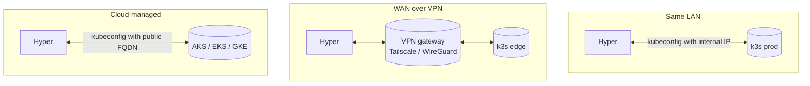

# Clusters & kubeconfig

This document explains how Celeste Hyper models clusters, how to register one, what the kubeconfig file must look like, and the operational hygiene to keep it healthy across LAN, WAN, and air-gapped topologies.

## Mental model

```mermaid
flowchart LR
  subgraph host["celeste-hyper host"]
    cfg["config.json: clusters[]"]
    kcdir["/etc/celeste-hyper/clusters/<br/>&lt;id&gt;.kubeconfig (one per cluster)"]
    pool["K8sPool<br/>(lazy K8s per id)"]
  end
  subgraph N["Remote / local clusters"]
    A[(prod-vm1<br/>k3s)]
    B[(staging-aks<br/>AKS)]
    C[(edge-rpi<br/>k3s on ARM)]
  end
  cfg -. seed on first boot .-> sqlite[(SQLite clusters table)]
  kcdir --> pool
  sqlite --> pool
  pool -- kubectl --kubeconfig=... --> A
  pool -- kubectl --kubeconfig=... --> B
  pool -- kubectl --kubeconfig=... --> C
```

Each cluster is identified by an immutable `id`. Two services in two clusters with the same name are two separate registry entries (`payments-prod`, `payments-staging`). Registering a cluster does **not** touch the cluster itself: it only persists a label and a path to a kubeconfig file the host can read.

## Cluster fields

| Field | Required | Notes |
|---|---|---|
| `id` | yes | Lowercase, `[a-z0-9.-]+`. **Immutable** once created. |
| `name` | yes | Human-readable label shown in the UI. |
| `kubeconfigPath` | yes | Absolute path on the hyper host. Must be readable by the hyper process. |
| `defaultNamespace` | yes | Used as a fallback when a service doesn't specify one. |
| `runtime` | yes | `auto` (default), `k3s`, `docker`, `containerd`. Only consumed by `r2-bundle` deploys when running `ctr import`. |
| `enabled` | yes | When `false`, the poller skips the cluster entirely. |

`id` and `runtime` are the load-bearing knobs in practice; `defaultNamespace` is mostly UI ergonomics.

## Kubeconfig hygiene

The kubeconfig file is the only thing that gets a service from "registered" to "deployable". A few rules:

- **Server URL** must be reachable from the hyper host. That sounds obvious; it surprises people more often than it should.
  - LAN / VPN: `https://10.0.x.x:6443` is fine.
  - WAN: prefer a public hostname behind an FQDN whose certificate the kubeconfig CA covers.
  - k3s default writes `https://127.0.0.1:6443`. Rewrite that on copy:
    ```bash
    sed -i 's|server: https://127.0.0.1:6443|server: https://prod-vm.internal:6443|' prod.kubeconfig
    ```
- **Credentials inside the file are the cluster's full authority** for whatever user it embeds. Treat the file like a private key:
  - `chmod 0600 prod.kubeconfig`
  - owner = the user running celeste-hyper (often `root` via systemd).
- **Service account, not the admin user.** For production clusters, generate a dedicated `ServiceAccount` + `ClusterRoleBinding` and bake its token into a kubeconfig. The included script in the *Real cluster onboarding* section below shows the minimum permissions.
- **Token rotation.** Long-lived tokens still expire. If the cluster started using bound tokens, periodically refresh and overwrite the kubeconfig file. Celeste Hyper picks up the new contents on the next `K8sPool.invalidate()` (triggered automatically when you `PATCH /clusters/:id`).

## Real cluster onboarding (the recommended path)

1. **On the cluster**, create a service account scoped to what the hyper needs:

   ```yaml
   apiVersion: v1
   kind: ServiceAccount
   metadata: { name: celeste-hyper, namespace: kube-system }
   ---
   apiVersion: rbac.authorization.k8s.io/v1
   kind: ClusterRoleBinding
   metadata: { name: celeste-hyper }
   roleRef:
     apiGroup: rbac.authorization.k8s.io
     kind: ClusterRole
     name: cluster-admin   # or a tighter custom role
   subjects:
     - kind: ServiceAccount
       name: celeste-hyper
       namespace: kube-system
   ```

   For a tighter posture, swap `cluster-admin` for a custom role that allows `get/list` on the workloads + `update` on deployments + `create/patch` on configmaps and secrets in the namespaces you target.

2. **Generate a kubeconfig** for that service account. Convenience script:

   ```bash
   SA=celeste-hyper
   NS=kube-system
   SERVER=https://prod-vm.internal:6443

   SECRET=$(kubectl -n "$NS" get sa "$SA" -o jsonpath='{.secrets[0].name}')
   TOKEN=$(kubectl -n "$NS" get secret "$SECRET" -o jsonpath='{.data.token}' | base64 -d)
   CA=$(kubectl -n "$NS" get secret "$SECRET" -o jsonpath='{.data.ca\.crt}')

   cat > prod.kubeconfig <<EOF
   apiVersion: v1
   kind: Config
   clusters:
     - name: prod
       cluster:
         server: ${SERVER}
         certificate-authority-data: ${CA}
   users:
     - name: celeste-hyper
       user:
         token: ${TOKEN}
   contexts:
     - name: prod
       context: { cluster: prod, user: celeste-hyper }
   current-context: prod
   EOF
   ```

3. **Copy the file to the hyper host** and protect it:

   ```bash
   scp prod.kubeconfig root@hyper-host:/etc/celeste-hyper/clusters/prod.kubeconfig
   ssh root@hyper-host 'chmod 0600 /etc/celeste-hyper/clusters/prod.kubeconfig && chown root:root $_'
   ```

4. **Register the cluster from the UI** (Add cluster) or directly:

   ```bash
   curl -X POST http://hyper-host:8080/api/clusters \
     -H 'Content-Type: application/json' \
     -d '{
       "id": "prod",
       "name": "Production VM 1",
       "kubeconfigPath": "/etc/celeste-hyper/clusters/prod.kubeconfig",
       "defaultNamespace": "default",
       "runtime": "k3s",
       "enabled": true
     }'
   ```

   Cluster appears in the UI immediately; the next poller tick runs `kubectl --raw=/readyz` and surfaces a *Reachable / Degraded / Unreachable* pill.

## Network topologies



- **Same LAN** — straightforward; rewrite the server URL on copy and move on.
- **WAN over VPN** — recommended. The kubeconfig keeps an internal IP, but reachability is handled by the VPN. No public ingress on the API server.
- **Cloud-managed clusters** — usually their tooling (`az aks get-credentials`, `aws eks update-kubeconfig`, `gcloud container clusters get-credentials`) emits a ready-to-use kubeconfig with a public hostname and an OIDC or aws-iam-authenticator exec block. Beware: an `exec` plugin in the kubeconfig requires the matching CLI on the hyper host. For long-running daemons, prefer a static token-based kubeconfig — generate one with a service account as shown above.

## Health checks

The poller does a cheap probe per cluster on every tick:

```
kubectl --raw=/readyz
```

- `ok` body, exit 0 → **Reachable**
- exit 0 but body != "ok" → **Degraded** (typically a transient component during cluster boot)
- exit != 0 → **Unreachable** (cert, network, or auth issue — the error message is preserved in the UI tooltip)

A manual probe is also available via the UI ("Check now" on each cluster card) and via the API:

```bash
curl -X POST http://hyper-host:8080/api/clusters/prod/check
```

## Finding clusters with network discovery (P1.11)

If you don't know where an API server lives (a homelab or VPS estate), `POST /api/discovery/scan`
(admin-only) probes IPs/CIDRs for Kubernetes apiservers and returns candidates you can promote into
the Add Cluster form. The "Discovery" page in the UI wraps this.

> ⚠️ **Only scan networks you own or are explicitly authorized to scan.** Port-scanning third-party
> hosts is an abuse vector and may be illegal. Three guardrails are in place: the endpoint is
> **admin-only**, it refuses to run unless the request carries the literal
> `"consent": "scan-acknowledged"`, and every scan is logged with the operator and the targets.
> Scans are bounded (≤ 1024 IPs/scan, 1.5 s/probe by default, concurrency-capped).

Discovery only *finds* candidates — it never fabricates credentials. Promotion prefills the server
endpoint into the Add Cluster form; you still supply a kubeconfig the normal way (see below).

## Removing a cluster

`DELETE /api/clusters/:id` will refuse to remove a cluster that still has services attached — the registry blocks it to avoid orphaning services. To migrate:

1. Patch the affected services to point at a new cluster (`PATCH /api/services/:name` with `{ "clusterId": "new" }` — same `sourceType`).
2. Or unregister them first (`DELETE /api/services/:name`) — this only affects the celeste-hyper registry, not the cluster itself.

## Operational notes

- The `K8sPool` caches one `K8s` (and therefore one resolved kubeconfig path) per cluster id. Editing the cluster via the API invalidates that cache entry; the next call reads the kubeconfig file fresh.
- The kubeconfig file is read on every `kubectl` invocation (we shell out, no long-lived client). Rotating the file content is therefore live — no restart required.
- Cluster id is immutable so that the audit log (deployments table) keeps a stable reference. Renaming would require recreating + remapping every service row.
