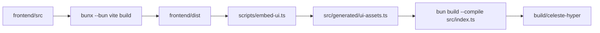

# Frontend development and production packaging

Celeste Hyper keeps the production install as a single executable, but the UI is developed as a separate Vite application under `frontend/`.

The development workflow runs two processes: the Bun/Elysia backend serves `/api`, and Vite serves the React UI with a proxy back to the backend. The production workflow builds the Vite app, embeds the generated assets into a TypeScript module, and compiles everything into the final Bun binary.

## Stack

| Layer | Tooling |
|---|---|
| Runtime | Bun |
| Backend | Elysia + Bun.serve |
| Frontend | Vite + React + TypeScript + SWC |
| Styling | Tailwind CSS |
| UI components | Local typed React primitives + Lucide icons |
| UI structure | Atomic Design-inspired component layers |

Vite runs with Bun using the official Bun guidance:

```bash
bunx --bun vite
```

The `--bun` flag makes Vite's CLI run on Bun instead of following Vite's Node shebang.

## Directory layout

```txt
frontend/
  package.json
  vite.config.ts
  index.html
  src/
    app/
    shared/
      api/
      types/
    components/
      atoms/
      molecules/
      organisms/
    screens/
      modals/

src/
  generated/
    ui-assets.ts
  routes/
    api.ts
    ui.ts
```

`frontend/dist` is an intermediate build artifact only. It is not copied to production hosts.

## Local development

Install dependencies from the root and from the frontend package:

```bash
bun install
bun install --cwd frontend
```

Start the backend API in one terminal:

```bash
bun run dev
```

Start the frontend in another terminal:

```bash
bun run --cwd frontend dev
```

The frontend dev server should run on Vite's default port:

```txt
http://localhost:5173
```

The backend continues to run on the configured Celeste Hyper port, usually:

```txt
http://localhost:8080
```

During development, Vite proxies API and SSE traffic to the backend:

```ts
server: {
  proxy: {
    "/api": "http://localhost:8080",
  },
}
```

The frontend must call relative paths such as `/api/services`, never hardcoded hosts. This keeps the same API client usable in development and production.

## Frontend scripts

`frontend/package.json` should use Bun-aware Vite scripts:

```json
{
  "scripts": {
    "dev": "bunx --bun vite",
    "build": "bunx --bun vite build",
    "preview": "bunx --bun vite preview"
  }
}
```

## Root scripts

The root `package.json` owns the production pipeline:

```json
{
  "scripts": {
    "frontend:dev": "bun run --cwd frontend dev",
    "frontend:build": "bun run --cwd frontend build",
    "embed:ui": "bun scripts/embed-ui.ts",
    "build": "bun run frontend:build && bun run embed:ui && bun build --compile --minify --sourcemap src/index.ts --outfile build/celeste-hyper",
    "build:linux-x64": "bun run frontend:build && bun run embed:ui && bun build --compile --minify --sourcemap --target=bun-linux-x64 src/index.ts --outfile build/celeste-hyper-linux-x64",
    "build:linux-arm64": "bun run frontend:build && bun run embed:ui && bun build --compile --minify --sourcemap --target=bun-linux-arm64 src/index.ts --outfile build/celeste-hyper-linux-arm64"
  }
}
```

## Production packaging

Production builds are single-binary builds.

The pipeline is:



The embed step reads every file in `frontend/dist` and generates `src/generated/ui-assets.ts` with:

- route path
- content type
- cache policy metadata
- file bytes or text content

`src/routes/ui.ts` imports the generated module and serves the assets directly from memory. The final binary does not need `frontend/dist`, `node_modules`, or a separate web server.

## Runtime serving behavior

The backend route order stays the same:

1. `/api/*` is served by `src/routes/api.ts`.
2. `/assets/*` is served from embedded Vite assets.
3. `/` serves embedded `index.html`.
4. Non-API unknown routes fall back to `index.html` for SPA navigation.

Recommended cache behavior:

| Path | Cache-Control |
|---|---|
| `/` | `no-cache` |
| `/index.html` | `no-cache` |
| `/assets/*` | `public, max-age=31536000, immutable` |
| fallback SPA routes | `no-cache` |

## Production build commands

Build for the current host:

```bash
bun run build
```

Build for the usual Linux VM target:

```bash
bun run build:linux-x64
```

Build all targets:

```bash
bun run build:all
```

The deploy artifact remains a single file:

```txt
build/celeste-hyper-linux-x64
```

Install it the same way as before:

```bash
sudo BINARY=./build/celeste-hyper-linux-x64 ./deploy/install.sh
```

## Verification checklist

Before shipping a production binary:

```bash
bun run --cwd frontend build
bun run typecheck
bun run build
```

Then run the binary and verify:

- `GET /` returns the embedded Vite app.
- `GET /assets/...` returns embedded JS/CSS with immutable cache headers.
- `GET /api/health` still returns backend health.
- Dashboard data loads through relative `/api` paths.
- Deploy progress polling works.
- Live logs work through `EventSource`.
- Theme persistence works through `localStorage`.
- Mobile layout remains usable.

## Important constraints

- Do not serve `frontend/dist` from disk in production.
- Do not hardcode backend URLs in frontend code.
- Do not commit generated `frontend/dist` unless explicitly required by release tooling.
- Keep `src/generated/ui-assets.ts` deterministic so repeated builds produce stable output when frontend assets do not change.
