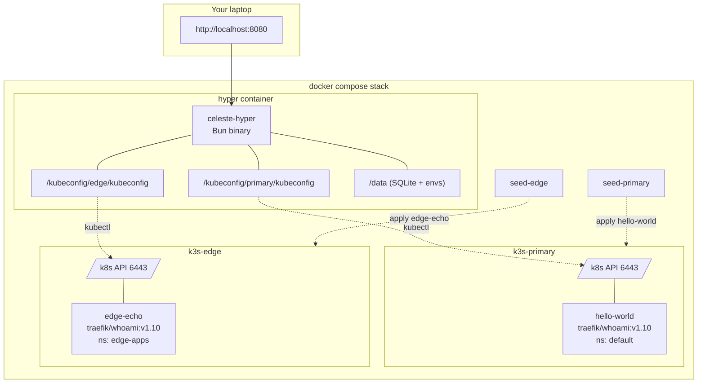
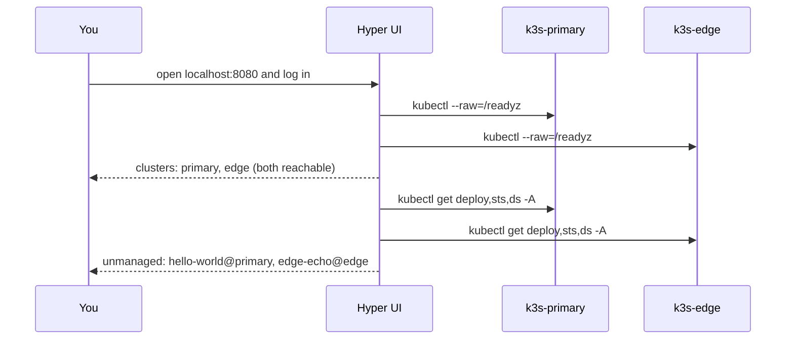

# Local stack walkthrough

The repository ships a `compose.yaml` that brings up **two real k3s clusters** in containers, seeds each with a different workload, and runs celeste-hyper against both. This is the fastest way to feel out the UI and the multi-cluster posture without touching a real VM.

## Topology



Two clusters live on the compose network. The seed containers wait for k3s readiness, rewrite the embedded `127.0.0.1` server URL to the compose hostname (`k3s-primary`, `k3s-edge`), drop the resulting kubeconfig in a shared volume, and apply the manifests. Hyper mounts both kubeconfigs read-only and registers both clusters at boot from `config.docker.json`.

## Quick start

```bash
cd celeste-hyper
docker compose up --build
```

When the stack settles (~60 s for the first run, far less after that), open:

```
http://localhost:8080
```

On a fresh volume, log in with the temporary first-run user `admin` / `admin` and change the password when prompted.

You should see:

- **Clusters** section listing `primary` and `edge`, both *Reachable*.
- **Discovered workloads** showing both `hello-world` (in `primary`) and `edge-echo` (in `edge`), each tagged with its cluster pill.



## What to click

1. **Adopt `hello-world`** in the Discovered workloads section. Pick cluster `primary` (pre-filled). It moves into Managed services, labelled *registry pull*, with the `traefik/whoami` image reference.

2. **Click the card** to open the detail dialog:
   - Networking: ClusterIP `10.43.x.x`, NodePort `30180`
   - Pods: 2 entries with pod IPs `10.42.x.x`
   - Live logs: pick a pod → **Stream logs** → real-time output from `traefik/whoami`

3. **Deploy a new version**:
   - Click *Deploy* on the card → the modal lists tags from Docker Hub (sorted, filterable)
   - Pick `v1.10.4` → status flips from *pending* → *applying* → *done* in ~5 s

4. **Repeat for `edge-echo`** in the `edge` cluster. Same flow, different cluster.

5. **Edit env files**: open `config.env` on a service, paste `LOG_LEVEL=debug`, save. The next deploy will apply it as a ConfigMap; the dialog now shows the parsed keys.

## Useful commands

```bash
# Tail the hyper backend in JSON
docker compose logs -f hyper

# Inspect primary cluster from inside hyper container
docker compose exec hyper kubectl --kubeconfig=/kubeconfig/primary/kubeconfig get pods -A

# Tear everything down (including persistent volumes)
docker compose down -v
```

## Configuration in the demo

The stack overrides a handful of fields via `config.docker.json` (baked into the image) and environment variables (in `compose.yaml`):

| Where | Why |
|---|---|
| `config.docker.json: clusters[]` | Pre-registers `primary` + `edge` so you don't see an empty UI on first boot. |
| `config.docker.json: poller.intervalSec: 15` | Tighter than the 60 s default so you see scan updates quickly. |
| `env R2_*` | Placeholder R2 creds — the `r2-bundle` flow won't list anything in this stack. Replace these envs with real R2 credentials in `compose.yaml` if you want to try the bundle flow against a real bucket. |

## Differences from a production install

| Concern | Demo | Production |
|---|---|---|
| How many k3s | 2 containers | Real VMs, often k3s HA |
| kubeconfig | Generated by the seed and dropped in a docker volume | Generated from a service account; copied to `/etc/celeste-hyper/clusters/<id>.kubeconfig` |
| Hyper binary | Compiled at `docker compose build`, runs as PID 1 inside Bun image | Compiled with `bun run build:linux-x64`, installed by `deploy/install.sh`, supervised by systemd |
| Reachability | Compose network only (no host port exposed) | Built-in auth, served behind TLS through VPN / Cloudflare Tunnel / reverse proxy |
| R2 | Placeholder; r2-bundle flow disabled | Real bucket; r2-bundle is typically the offline-friendly path |

The application code path is the same in both — the demo is a faithful environment for poking at the UI, the API, the detail view, the deploy modal, and the multi-cluster flow.

## Resetting

If you ever want to start completely clean:

```bash
docker compose down -v
docker compose up --build
```

State (SQLite, env files, downloaded bundles) is stored in the `hyper-data` volume; kubeconfigs in `hyper-primary-kc` / `hyper-edge-kc`. `down -v` wipes all of them.
