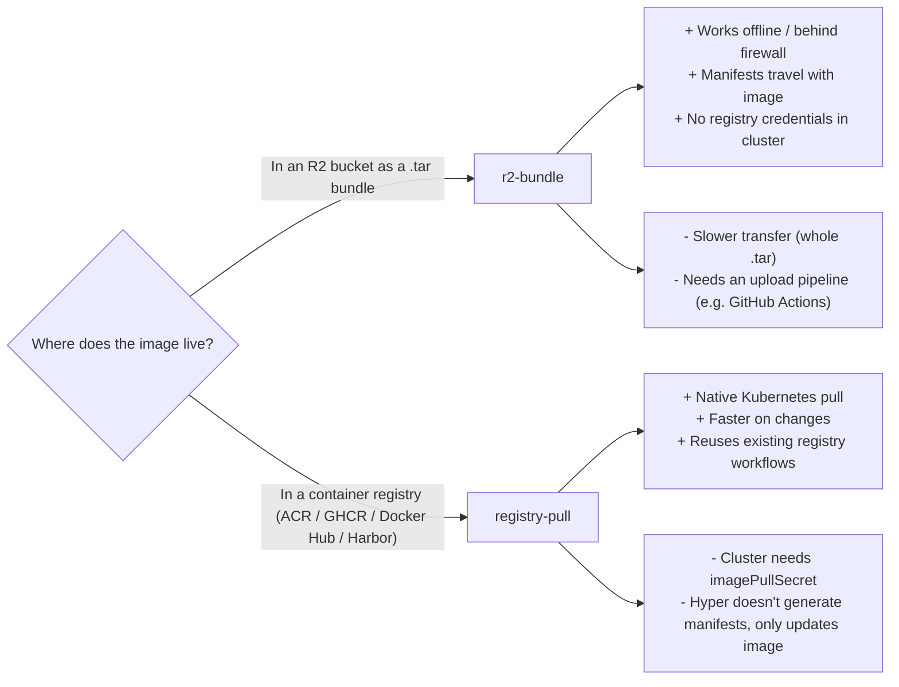
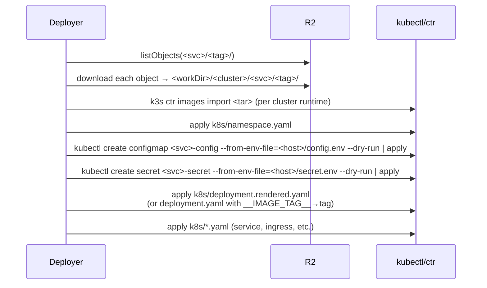
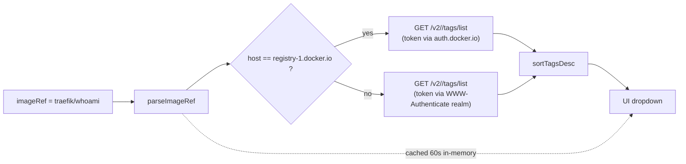
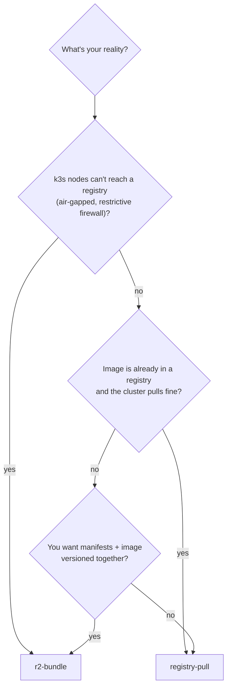

# Service sources: `r2-bundle` vs `registry-pull`

Celeste Hyper supports two distribution models for the image that a service is going to run. They are mutually exclusive per service, and the choice is made at registration time — switching means deleting and recreating the service.

## TL;DR



## `r2-bundle` in detail

A bundle in R2 looks like this:

```
s3://<bucket>/<svc>/<tag>/
  <svc>-<tag>-amd64.tar      # docker image, ready for ctr import / docker load
  k8s/
    namespace.yaml
    deployment.yaml           # template with __IMAGE_TAG__ placeholder
    deployment.rendered.yaml  # optional: tag already substituted
    service.yaml
    ...                       # any other plain *.yaml
  install.sh                  # ignored by hyper; useful for manual runs
  README.md
```

The same convention works for any project; the only thing hyper enforces is the directory shape.

### What happens when you deploy



Notes that surprise people:

- **`configmap.example.yaml` and `secret.example.yaml` in the bundle are ignored.** The deployer reads `config.env` and `secret.env` from the host filesystem and applies those instead. Secrets never live in git.
- **Image-import is the per-cluster runtime concern**: k3s → `k3s ctr images import`, vanilla containerd → `ctr -n=k8s.io images import`, docker → `docker load -i`. The `runtime` field on the cluster picks the path.
- **Local vs remote node (P4).** The `runtime` import above runs on the **hyper host** — correct only when hyper *is* the target node (`imageLoad: local`, the default). For a **remote** cluster (e.g. an enrolled worker, `imageLoad: remote-pull`) the deployer instead presigns the tar and runs a one-shot privileged in-cluster import Job that loads it onto the *node's* containerd (`ctr -n k8s.io images import`, using the node's own k3s binary — no 250 MB helper image). So an r2-bundle deployed from the master lands on the remote machine, with no registry credentials on the cluster. See [`clusters.md`](./clusters.md#fleet-enrollment-p4) and the architecture doc.
- **The image tar must be a complete, `ctr`-importable archive.** Both the local and remote paths run `ctr images import`, which needs every blob the manifest references to be present in the tar. Build it single-arch with a tool that emits a self-contained archive — `skopeo copy --override-arch <arch> docker://<image> oci-archive:<name>-<tag>-<arch>.tar:<ref>`, or `ctr images export`. **Avoid `docker save` on a Docker daemon using the containerd image store** (Docker 25+/OrbStack): it can emit an *incomplete multi-arch* archive, and `ctr import` then fails `content digest sha256:… : not found`. The ref you tag the archive with must match the manifest's `image:` (with `imagePullPolicy: Never`).
- **Manifests are applied in filename order**, except that `namespace.yaml` always goes first and the bundle's `*.example.yaml` are skipped.

### Configuration fields

| Field | Default | Meaning |
|---|---|---|
| `r2Prefix` | required | Bucket prefix the service lives under. Must end with `/`. |
| `manifestRoot` | `k8s` | Sub-directory of the bundle that contains the YAMLs. |
| `imageTarPattern` | `{name}-{tag}-amd64.tar` | Lets you change the .tar file name produced by your build. |
| `imageRefPrefix` | `docker.io/library` | Used when constructing the resulting in-cluster image ref (matches `k3s ctr` defaults). |

## `registry-pull` in detail

The image is already in some registry. Hyper does not build, push, or copy it. On deploy, hyper runs:

```bash
kubectl set image <kind>/<workloadName> <containerName>=<imageRef>:<tag> -n <namespace>
kubectl rollout status <kind>/<workloadName> --timeout=180s
```

Everything else — the Deployment manifest, the imagePullSecret, the Service, the Ingress — must already exist in the cluster. Adoption is the natural entry point: pick a workload from "Discovered workloads", click Adopt, and hyper records enough metadata to call `set image` from then on.

### When to use it

- Cluster has registry credentials and you have an existing deploy story for first-time installs (Helm, Kustomize, ArgoCD, ad-hoc kubectl). Hyper takes over the *roll-out* of new tags.
- You want to ship to Azure Container Registry, GHCR, Harbor, or any other registry without uploading the .tar to R2.

### Configuration fields

| Field | Default | Meaning |
|---|---|---|
| `imageRef` | required | The image reference **without** a tag, e.g. `myacr.azurecr.io/payments`. |
| `workloadKind` | `Deployment` | `Deployment`, `StatefulSet`, or `DaemonSet`. |
| `workloadName` | service name | Defaults to the service name; override when the cluster object has a different name. |
| `containerName` | service name | The container inside the pod spec to retag. |
| `imagePullSecret` | — | Name of an existing `kubernetes.io/dockerconfigjson` Secret in the namespace. Hyper does not create or rotate it. |

### Listing available tags

For public registries (Docker Hub, GHCR public, any registry that allows anonymous `tags/list`), hyper lists tags via the OCI distribution API v2 with anonymous token flow. The deploy modal shows them sorted descending (numeric-aware), filterable.

For private registries, the anonymous flow fails and hyper marks the tags as *Auth required*. You can still deploy by typing the tag manually. Adding per-registry credentials is a roadmap item — for now, treat the dropdown as "best effort" and the manual input as authoritative.



## Choosing per environment



It is fine to mix: one cluster can host both kinds of services side by side.

## `git-sync` in detail (P2.3)

A third source type: the manifests live in a git repo at a ref. Hyper shallow-clones the ref, then
runs the same env-merge + `kubectl apply` pipeline as `r2-bundle` over the repo's `gitPath`. The
deployed "tag" is the resolved commit SHA. The poller `git ls-remote`s the ref for new SHAs.

Fields: `gitUrl`, `gitRef` (default `main`), `gitPath` (repo-relative manifest dir, default `.`),
`deployKeyPath?` (a key file under the server's git-keys dir, passed via `GIT_SSH_COMMAND` — never argv).

**Security (this is a server-side fetch of an operator-supplied URL, so it's locked down):**

- **Host allowlist (SSRF):** `HYPER_GIT_HOST_ALLOWLIST` (comma-separated hosts) is required. An empty
  allowlist **disables git-sync entirely** — service create is refused. A `gitUrl` whose host isn't
  in the allowlist is rejected at create *and* re-validated at deploy time. Userinfo-masquerade
  (`https://github.com@evil.com/…`) resolves to the real host (`evil.com`) and is rejected.
- **Transport allowlist:** only `https`/`http`/`ssh`/`git` schemes (and the scp form `git@host:path`).
  Command-bearing/local transports (`ext::` is RCE, `file://` is local-FS SSRF) are refused.
- **Argument injection:** `gitRef` is constrained to git's ref grammar (no leading `-`, no `..`), so it
  can't inject a flag into `git clone --branch <ref>`; the URL/dest are placed after a `--` separator.
- **Path traversal:** `gitPath` rejects `..` segments / absolute paths and must resolve under the repo
  root; `deployKeyPath` must resolve strictly inside `HYPER_GIT_KEYS_DIR`
  (default `/etc/celeste-hyper/git-keys`), else `422 key-outside-allowed-dir`.
